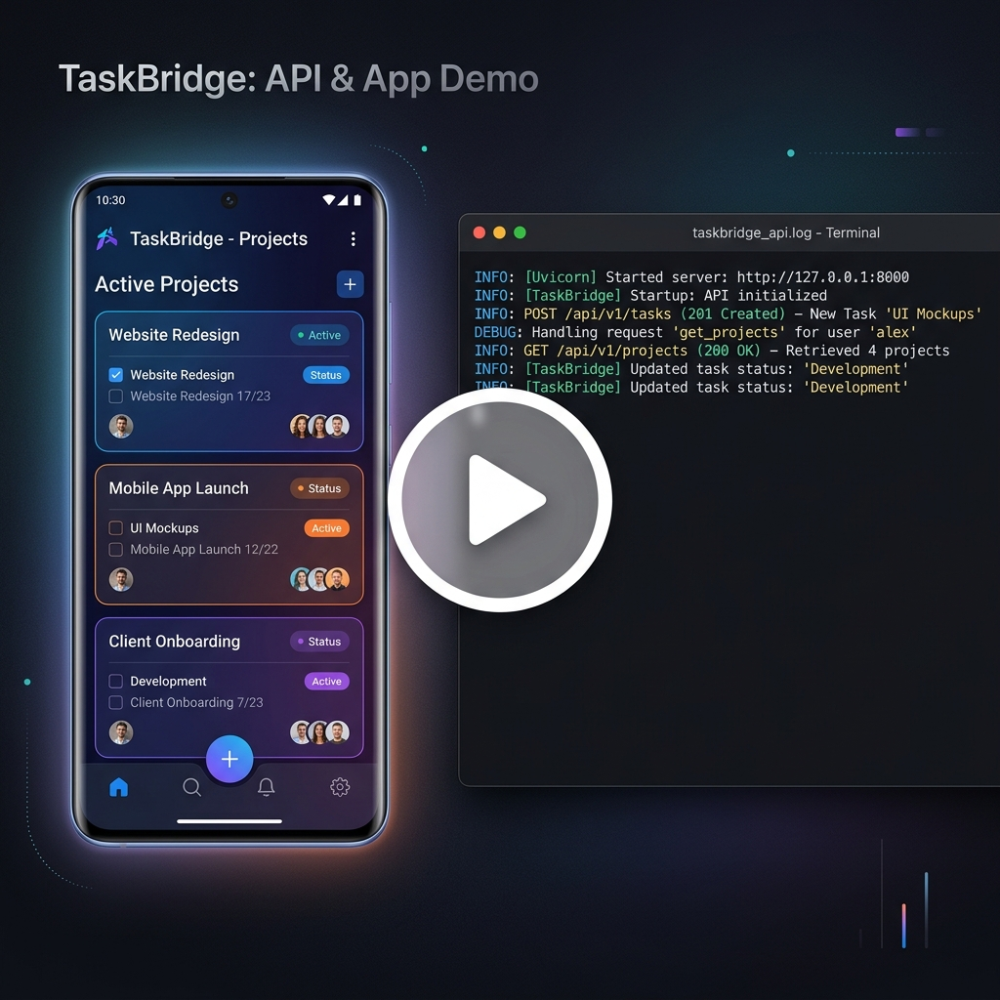
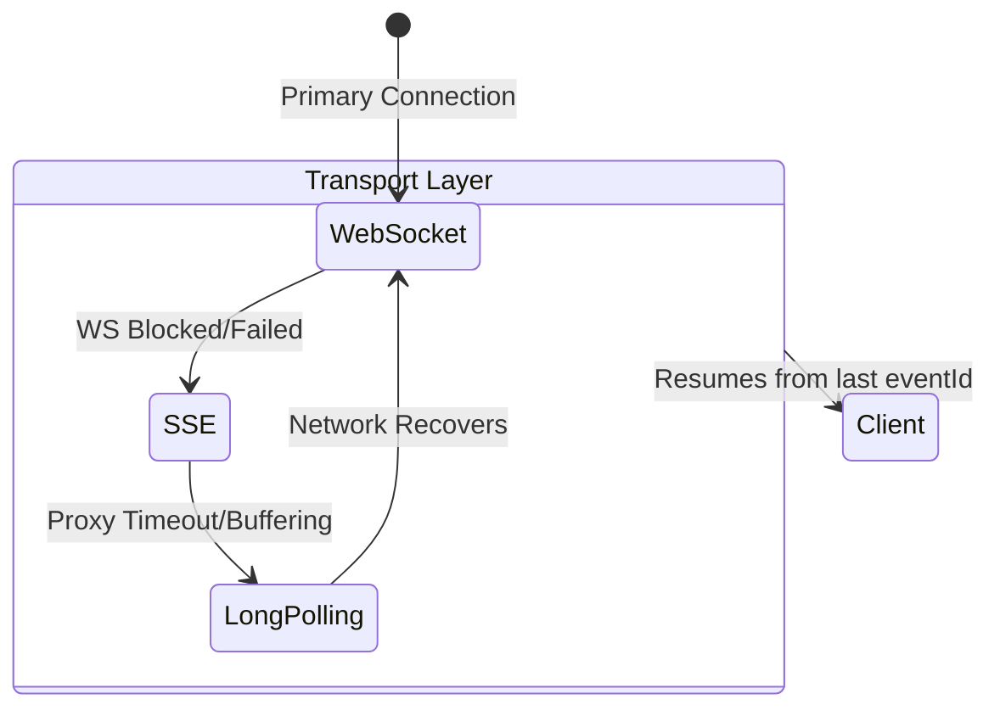
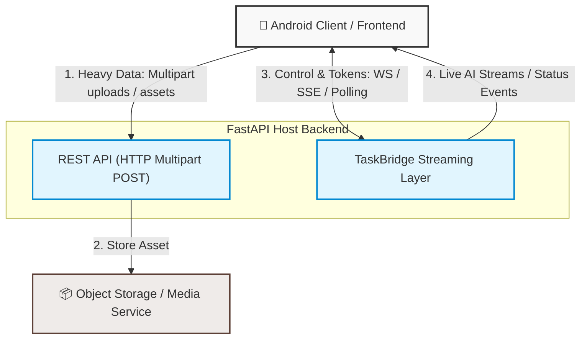

# TaskBridge

[](https://opensource.org/licenses/Apache-2.0)
[](https://badge.fury.io/py/taskbridge-fastapi)
[](https://search.maven.org/artifact/io.github.nikkiw.taskbridge/taskbridge-core)
[](https://github.com/nikkiw/task-bridge/actions/workflows/backend-ci.yml)
[](https://github.com/nikkiw/task-bridge/actions/workflows/android-ci.yml)
[](docs/llms.txt)

TaskBridge manages long-running tasks and AI response streaming, saving you from writing custom WebSocket reconnection logic and Android fallback layers. The library automatically degrades along the `WebSocket -> SSE -> Long Polling` chain, keeping your FastAPI backend clean and stateless.

<p align="center">
  <a href="docs/media/task-bridge-example-screencast.mp4">
    
  </a>
</p>

## Overview

TaskBridge is a protocol-driven infrastructure layer for long-running, interactive tasks. It separates:

- Android client behavior and recovery;
- reusable FastAPI backend transport and orchestration;
- runtime-specific execution adapters such as Temporal.

The repository is organized so those layers can evolve independently without changing the public task-streaming model.

## Installation

### 1. Backend (FastAPI)
```bash
pip install taskbridge-fastapi==0.1.1

# Optional: Temporal adapter
pip install taskbridge-temporal==0.1.0
```

### 2. Android Client (Kotlin)
Add the dependencies to your module's `build.gradle.kts` (ensure `mavenCentral()` is in your repositories list):
```kotlin
dependencies {
    implementation("io.github.nikkiw.taskbridge:taskbridge-core:0.1.0")
    // OkHttp transport adapter (recommended):
    implementation("io.github.nikkiw.taskbridge:taskbridge-transport-okhttp:0.1.0")
}
```

## Quick Start (Zero Setup)

Backend developers can test the streaming core locally using `uv` or instantly run a sandbox in the browser. No Docker, Redis, or Temporal is required to get started.

[](https://codespaces.new/nikkiw/task-bridge)

**1. Server (FastAPI in-memory Greeter):**

```bash
uv run --no-project examples/01-minimal-greeter/app.py
```

**2. Client (Android / Kotlin):**

```kotlin
val created = client.startTaskJson(
    TaskCreateJsonRequest(clientRequestId = "req-1", taskType = "greet")
)

// Automatically handles disconnections and resumes from the last eventId
client.observeTaskEvents(created.taskId).collect { event ->
    when (event) {
        is TaskProgressEvent -> println(event.payload)
        is TaskCompletedEvent -> println("Done!")
    }
}
```

**Or test via terminal (Long Polling):**

```bash
curl -X POST http://127.0.0.1:8000/api/v1/tasks \
  -H "Content-Type: application/json" \
  -d '{"clientRequestId": "req-1", "taskType": "greet", "input": {"name": "TaskBridge"}}'

# Copy the taskId from the response of the previous request
curl "http://127.0.0.1:8000/api/v1/tasks/<taskId>/events?limit=50&wait_timeout_ms=5000"
```

## Project Structure

- `android/`: Android SDK, OkHttp transport adapter, and sample app.
- `backend/taskbridge-fastapi/`: reusable FastAPI package for task transport, services, and route builders.
- `backend/adapters/`: publishable integration packages for runtime-specific execution backends.
- `protocol/`: shared API contracts, schemas, and fixtures.
- `examples/`: runnable **consumer** examples (see [`examples/README.md`](examples/README.md)).
  - [`examples/fastapi-host/`](examples/fastapi-host/README.md) — minimal FastAPI host wiring `taskbridge-fastapi`.
  - [`examples/android-integration/`](examples/android-integration/README.md) — run `android/sample` against that host.
- `docs/`: MkDocs site content, ADRs, and contributor-facing guides.

## Core Features

- **Replay-safe streaming**: events are durable, ordered, and keyed by monotonic `eventId`.
- **Android recovery and fallback**: the SDK resumes from persisted checkpoints and degrades `WS -> SSE -> polling`.
- **Host-owned backend integration**: FastAPI hosts keep app construction, auth, and infrastructure ownership.
- **Runtime isolation**: adapters integrate Temporal or other runtimes without leaking vendor behavior into backend core.
- **Idempotent task creation and actions**: client-generated IDs are part of the public contract.

## Resilience Architecture

TaskBridge automatically manages transport degradation on mobile networks without losing events.



## Traffic Splitting (Bottleneck Prevention)

TaskBridge separates data paths to maintain low latency and prevent connection clogging. Heavy binary files are uploaded via traditional REST endpoints, whereas lightweight AI tokens are streamed instantly.



## Backend Engineering Baseline

The Python backend should follow the same practical conventions used across the portfolio's modern Python services:

- `uv` for environment and dependency management
- `ruff` for linting and formatting
- `pytest` for unit and integration tests
- typed Pydantic models and explicit config boundaries
- structured logs, health/readiness checks, and CI-friendly commands
- Docker-friendly local setup and reproducible developer workflows

## Out of Scope for v1

- domain-specific workflow logic
- generic topic-based pub/sub
- backend-vendor lock-in inside the core package
- a Kotlin Multiplatform API guarantee

## Monorepo Model

`task-bridge` is a monorepo with independently publishable package surfaces.

Publishable packages:

- `backend/taskbridge-fastapi`
- `android/taskbridge-core`
- `android/taskbridge-transport-okhttp`
- adapter packages under `backend/adapters/`

Repository support layers:

- `protocol/` for the wire contract
- `docs/` for the docs site and architecture guidance
- `examples/` for runnable integration setups

Release history is package-scoped:

- `android/CHANGELOG.md`
- `backend/taskbridge-fastapi/CHANGELOG.md`
- `backend/adapters/temporal/CHANGELOG.md`

The root [`CHANGELOG.md`](CHANGELOG.md) is only an index to those package changelogs.

For Python packages, the committed `pyproject.toml` version is a placeholder `0.0.0.dev0`. The published version comes from the release tag in CI, which avoids routine version-bump merge conflicts.

## Documentation

Repository documentation is published from the MkDocs source in `docs/` and combines hand-written concept guides with generated API reference.

For LLM-friendly navigation, `scripts/docs_prepare.py` also writes a curated `docs/llms.txt`, which MkDocs publishes as `/llms.txt` alongside the main site. Because the repository is fully AI-agent ready, you can feed the link to this file directly to your AI code editor (such as Cursor or Windsurf) for high-accuracy, zero-context automatic integration.

Recommended reading order:

- `docs/index.md` for the overall architecture story
- `docs/android/` for client concepts and recovery
- `docs/backend/` for host integration and service/runtime boundaries
- `docs/adapters/` for runtime-specific execution layers
- `docs/protocol/` for wire-level compatibility

Primary commands:

- `uv sync --group docs --group dev`
- `uv run python scripts/docs_prepare.py`
- `uv run mkdocs serve`

For `uvx`, strict build, Dokka staging behavior, and GitHub Pages workflow, use the canonical guide at `docs/documentation/index.md`.

Source material still lives in the repository:

- [docs/architecture/index.md](docs/architecture/index.md) for the architecture overview
- [docs/android/index.md](docs/android/index.md) for Android concepts
- [docs/backend/index.md](docs/backend/index.md) for backend concepts
- [docs/adapters/index.md](docs/adapters/index.md) for adapter concepts
- [protocol/README.md](protocol/README.md) for wire-level compatibility
- [CONTRIBUTING.md](CONTRIBUTING.md) for contributor guidance
- [docs/documentation/index.md](docs/documentation/index.md) for docs generation and maintenance workflow

For isolated parallel work, the repository convention is to use git worktrees under `.worktrees/`.

## Release Workflow

TaskBridge keeps the tag-push publication contract, but release preparation is changelog-driven.

- `prepare-release` generates a package changelog section and opens a release prep PR.
- Maintainers merge that PR with squash merge.
- Maintainers then push one of `android-vX.Y.Z`, `python-vX.Y.Z`, or `python-temporal-vX.Y.Z`.
- `publish-release.yml` publishes artifacts and creates or updates the GitHub Release from the package changelog section.

Release-bearing PR titles and squash titles must follow Conventional Commits, for example `feat(android): ...`, `fix(backend): ...`, or `feat(temporal)!: ...`.

## Validation Commands

From repository root:

- backend checks:
  - `cd backend/taskbridge-fastapi && uv sync --group dev`
  - `uv run ruff check && uv run ruff format --check && uv run pytest`
- Android checks:
  - `cd android && ./gradlew test`
- protocol contract checks:
  - `uv run python protocol/validate_protocol.py`
- docs checks:
  - `uv run python scripts/docs_prepare.py`
  - `uv run mkdocs build --strict`
