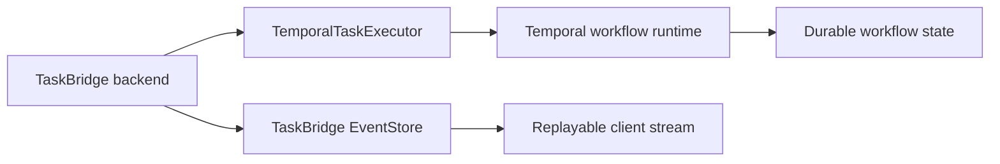

# Temporal Adapter

The Temporal adapter is the main example of how TaskBridge backend core connects to a durable workflow runtime without pushing runtime-specific behavior into `taskbridge-fastapi`.

## What the adapter owns

The Temporal adapter owns:

- implementing `TaskExecutor`;
- mapping `TaskRecord` into Temporal workflow input;
- deriving workflow IDs from TaskBridge task IDs;
- translating Temporal workflow updates into TaskBridge `TaskEvent` shapes when needed;
- runtime-specific cancellation behavior.

The adapter does not own:

- backend route handling;
- stream replay or transport loops;
- TaskBridge security policies;
- generic backend task orchestration services.

## Main types

The main public adapter concepts are:

- `TemporalTaskExecutor`
- `TemporalExecutorConfig`
- `WorkflowInputMapper`
- `DefaultWorkflowInputMapper`
- `TemporalWorkflowUpdate`
- `map_temporal_update_to_task_event`

## Executor shape

Real executor behavior from the adapter:

```python
class TemporalTaskExecutor(TaskExecutor):
    def __init__(self, *, temporal_client: Any, config: TemporalExecutorConfig) -> None:
        self._client = temporal_client
        self._config = config

    async def submit_task(self, task) -> None:
        workflow_id = self._config.workflow_id_for(task)
        input_payload = self._config.workflow_input_mapper.to_workflow_input(task)
        await self._client.start_workflow(
            self._config.workflow,
            input_payload,
            id=workflow_id,
            task_queue=self._config.task_queue,
        )
```

This is intentionally narrow: the adapter bridges submit/cancel orchestration into Temporal, while actual progress and terminal TaskBridge events are still emitted through the host’s TaskBridge event store flow.

## Configuration

`TemporalExecutorConfig` includes:

- `task_queue`
- `workflow`
- `workflow_id_prefix`
- `namespace`
- `cancellation_mode`
- `start_timeout_seconds`
- `workflow_input_mapper`

This is the main configuration boundary for controlling how TaskBridge tasks map into Temporal workflows.

## Workflow input mapping

The adapter does not assume your workflow input shape beyond a default generic mapper.

Default mapping shape:

```python
{
    "task_id": task.task_id,
    "task_type": task.task_type,
    "input_payload": task.input_payload,
    "metadata": task.metadata,
    "owner_id": task.owner_id,
}
```

Use a custom `WorkflowInputMapper` when your workflow contract requires a different shape.

## Cancellation modes

The adapter supports two cancellation strategies:

- `cancel`
- `signal`

That allows the host to choose whether cancellation should be a hard Temporal workflow cancellation or an application-level signal into the workflow.

## Durable boundary



This is the key architectural rule:

- Temporal keeps durable workflow internals;
- TaskBridge keeps client-facing transport events and replay semantics.

## Mapping workflow updates to TaskBridge events

The adapter includes a helper for turning runtime updates into TaskBridge-compatible events.

Supported kinds include:

- `progress`
- `message`
- `completed`
- `failed`
- `cancelled`

Unsupported kinds raise `ValueError`, which is intentional. The adapter should not silently invent public transport semantics for unknown workflow update kinds.

## Recommended host usage

- keep heavy workflow state in Temporal;
- emit compact, client-facing progress and terminal events through TaskBridge;
- use a custom input mapper when workflow inputs are product-specific;
- choose cancellation mode explicitly rather than relying on implicit runtime behavior.

## Related docs

- [Adapters](index.md)
- [Backend](../backend/index.md)
- [State and Runtime Boundaries](../backend/state-and-runtime-boundaries.md)
- [Adapter Python API Reference](../reference/adapters.md)
