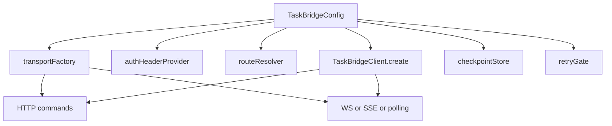

# Client and Config

`TaskBridgeClient` is the public entry point for Android consumers. You create it once from `TaskBridgeConfig`, then use it to send commands and observe one task stream at a time.

## What this concept owns

`TaskBridgeConfig` defines the contract between your app and the SDK:

- backend base URL;
- transport implementation;
- route resolution;
- auth header provisioning;
- checkpoint persistence;
- retry and failure policies;
- transport retry gate (for network awareness);
- diagnostics hooks.

If your integration feels unclear, the first place to inspect is usually the config, not the event model.

## When to use `Unit` context vs custom `Ctx`

The client is generic over `Ctx`.

- Use `Unit` when every request can use the same base auth and route logic.
- Use a custom `Ctx` type when routing or auth depends on runtime state such as tenant, workspace, account, or session.

Good uses for custom `Ctx`:

- per-account bearer tokens;
- tenant-specific path prefixes;
- different auth refresh behavior per request owner.

Bad uses for custom `Ctx`:

- passing UI objects or Android `Context`;
- storing mutable screen state;
- using it as a replacement for repository/domain state.

## Minimal production setup

```kotlin
val client =
    TaskBridgeClient.create(
        TaskBridgeConfig(
            baseUrl = "https://api.example.com",
            transportFactory =
                OkHttpTaskBridgeTransportFactory<Unit>(
                    OkHttpTaskBridgeTransportConfig(
                        okHttpClient = OkHttpClient(),
                    ),
                ),
            authHeaderProvider = { _, _ -> "Bearer your-token" },
        ),
    )
```

This is the default path for apps that already use OkHttp and only need one auth context.

## Config fields that matter most

### `baseUrl`

The HTTP base URL for the backend. Paths from `TaskBridgeRouteResolver` are resolved relative to it.

Use it for:

- switching between local, staging, and production backends;
- isolating checkpoints by environment, since checkpoint keys include the normalized base URL.

Do not use it for:

- encoding task IDs;
- embedding route fragments that belong in the resolver.

### `transportFactory`

This chooses how the SDK performs HTTP commands and streaming.

- Use `OkHttpTaskBridgeTransportFactory` for the standard Android stack.
- Provide a custom factory only if you intentionally want a different networking engine or transport instrumentation boundary.

### `authHeaderProvider`

The SDK calls this to resolve the `Authorization` header.

Its signature is effectively:

```kotlin
suspend (context: Ctx, forceRefresh: Boolean) -> String?
```

The `forceRefresh` flag becomes `true` after a token was rejected with `401`, giving your app a narrow place to refresh credentials.

Recommended behavior:

- return `null` for unauthenticated routes;
- return a full header value such as `Bearer <token>`;
- refresh only when `forceRefresh` is `true`.

### `routeResolver`

`TaskBridgeRouteResolver` maps the logical SDK operations onto path-only route strings.

Default resolver:

- `api/v1/tasks`
- `api/v1/tasks/{taskId}/events`
- `api/v1/tasks/{taskId}/cancel`
- `api/v1/tasks/{taskId}/actions`
- `api/v1/tasks/ws`
- `api/v1/tasks/{taskId}/events/stream`

Use a custom resolver when:

- your host app mounts TaskBridge under another prefix;
- tenants or products have different route layouts;
- your gateway exposes separate write and stream paths.

Do not use a custom resolver to work around backend contract drift. If the public contract changed, fix the contract first.

### `retryGate`

A strategy for suspending retry attempts until external conditions (like active network connectivity) are satisfied.

Defaults to `NoOpTransportRetryGate`, which immediately allows retries.

On Android, pass `AndroidConnectivityRetryGate(context)` to hold stream reconnection attempts while the device is offline, eliminating busy polling loops and saving user data/battery.

Example:
```kotlin
val config = TaskBridgeConfig(
    baseUrl = "https://api.example.com",
    retryGate = AndroidConnectivityRetryGate(context),
    authHeaderProvider = { _, _ -> "Bearer token" }
)
```

## Custom context and route example

```kotlin
data class SessionContext(
    val tenantSlug: String,
    val bearerToken: String,
)

class TenantRouteResolver : TaskBridgeRouteResolver<SessionContext> {
    override fun createTaskPath(context: SessionContext): String =
        "tenants/${context.tenantSlug}/api/v1/tasks"

    override fun pollEventsPath(
        context: SessionContext,
        taskId: String,
    ): String = "tenants/${context.tenantSlug}/api/v1/tasks/$taskId/events"

    override fun cancelTaskPath(
        context: SessionContext,
        taskId: String,
    ): String = "tenants/${context.tenantSlug}/api/v1/tasks/$taskId/cancel"

    override fun submitActionPath(
        context: SessionContext,
        taskId: String,
    ): String = "tenants/${context.tenantSlug}/api/v1/tasks/$taskId/actions"

    override fun webSocketPath(context: SessionContext): String =
        "tenants/${context.tenantSlug}/api/v1/tasks/ws"

    override fun streamEventsPath(
        context: SessionContext,
        taskId: String,
    ): String = "tenants/${context.tenantSlug}/api/v1/tasks/$taskId/events/stream"
}

val client =
    TaskBridgeClient.create(
        TaskBridgeConfig(
            baseUrl = "https://api.example.com",
            transportFactory =
                OkHttpTaskBridgeTransportFactory<SessionContext>(
                    OkHttpTaskBridgeTransportConfig(
                        okHttpClient = OkHttpClient(),
                    ),
                ),
            routeResolver = TenantRouteResolver(),
            authHeaderProvider = { context, _ -> "Bearer ${context.bearerToken}" },
        ),
    )
```

## Command surface

The client exposes two categories of public operations.

Write commands:

- `startTaskJson`
- `startTaskMultipart`
- `submitAction`
- `cancelTask`

Read stream:

- `observeTaskEvents`

This split is deliberate. Commands are retried as bounded HTTP operations. Observation is treated as a long-lived, recoverable stream.

## Multipart boundary

Use `startTaskMultipart` when the backend task needs binary attachments.

The SDK boundary here is `TaskBridgeMultipartAttachment`, not `MultipartBody.Part`.

That matters because:

- `taskbridge-core` stays transport-agnostic;
- OkHttp-specific request body details remain in the OkHttp adapter.

Important limitation:

- the current public API accepts attachment content as `ByteArray`;
- this is a good fit when your app already has the bytes in memory;
- this is not a streaming upload API for arbitrarily large files.

In other words, TaskBridge lets you create attachments directly, but you must materialize the payload bytes before calling `startTaskMultipart`.

Real multipart call shape:

```kotlin
val attachmentBytes = byteArrayOf(1, 2, 3)

val response =
    client.startTaskMultipart(
        clientRequestId = "req-2",
        taskType = "demo.image",
        inputJson = """{"source":"android"}""",
        metadataJson = null,
        attachments =
            listOf(
                TaskBridgeMultipartAttachment(
                    fileName = "sample.bin",
                    contentType = "application/octet-stream",
                    content = attachmentBytes,
                ),
            ),
    )
```

Android app example when bytes come from a `Uri` before entering TaskBridge:

```kotlin
val attachmentBytes =
    requireNotNull(contentResolver.openInputStream(fileUri)) { "Cannot open attachment" }
        .use { input -> input.readBytes() }

val response =
    client.startTaskMultipart(
        clientRequestId = "req-2",
        taskType = "demo.image",
        inputJson = """{"source":"android"}""",
        metadataJson = null,
        attachments =
            listOf(
                TaskBridgeMultipartAttachment(
                    fileName = "photo.jpg",
                    contentType = "image/jpeg",
                    content = attachmentBytes,
                ),
            ),
    )
```

Recommended guidance for consumers:

- use multipart for small or medium files that you intentionally load into memory;
- avoid presenting this API as a zero-copy or streaming upload mechanism;
- if your product needs very large uploads, document that constraint explicitly at the app layer.

## Interaction map



## Boundaries to keep clean

- Keep generic Android `Context` references, Room DAOs, and UI state outside `TaskBridgeConfig`. (External platform helpers like `AndroidConnectivityRetryGate` take `Context` at construction time but register themselves via the clean, platform-agnostic `TransportRetryGate` interface).
- Keep product payload validation in your app or backend contract, not in the generic client setup.
- Keep route customization in `TaskBridgeRouteResolver`, not in ad hoc string concatenation spread across call sites.

## Related docs

- [Events and Recovery](events-and-recovery.md)
- [Transport and Extension Points](transport-and-extension-points.md)
- [Storage and Policies](storage-and-policies.md)
- [Android API Reference](../reference/android.md)
