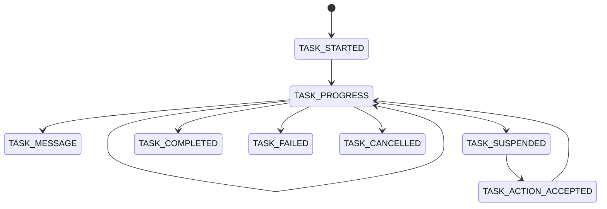
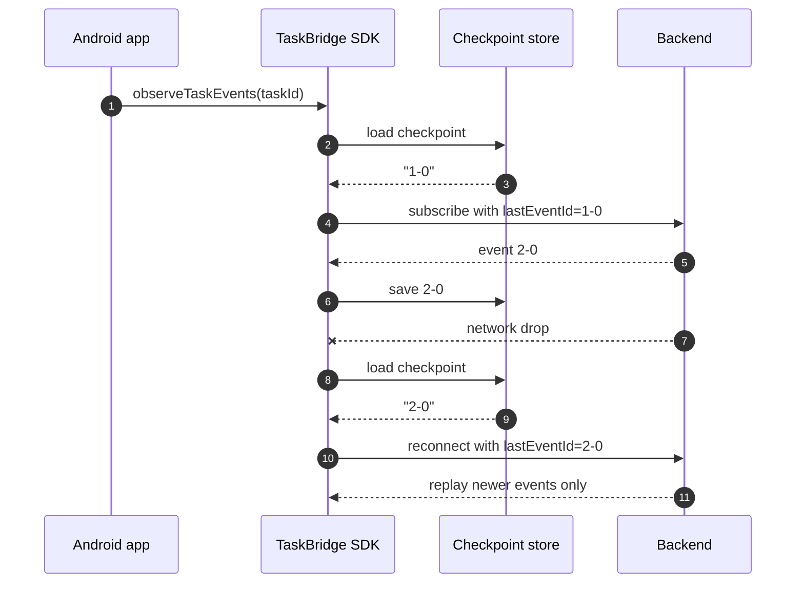

# Events and Recovery

TaskBridge models a backend task as a stream of `TaskEvent` objects. This is the core idea behind the Android SDK: commands create or mutate the task, while the event stream tells you what happened.

## Event families

Known event types in the public API:

- `TaskStartedEvent`
- `TaskProgressEvent`
- `TaskMessageEvent`
- `TaskSuspendedEvent`
- `TaskActionAcceptedEvent`
- `TaskCompletedEvent`
- `TaskFailedEvent`
- `TaskCancelledEvent`

The SDK can also emit `UnknownTaskEvent` when a wire event type is not mapped yet.

That is an intentional compatibility boundary:

- your app can keep the stream alive when the backend adds a forward-compatible event;
- your code can log or ignore unknown events instead of crashing the whole observation pipeline.

## Lifecycle in practice



Terminal events are:

- `TASK_COMPLETED`
- `TASK_FAILED`
- `TASK_CANCELLED`

When a terminal event arrives, the observation `Flow` finishes and the checkpoint for that task is cleared.

## Real observation example

```kotlin
client.observeTaskEvents(taskId).collect { event ->
    when (event) {
        is TaskProgressEvent -> {
            println("Progress: ${event.payload["progress"]}%")
        }
        is TaskCompletedEvent -> {
            println("Task finished successfully!")
        }
        else -> {
            println("Other event: $event")
        }
    }
}
```

This is the simplest consumer shape. In production, most apps should map these events into repository state or local storage rather than bind the raw stream directly to UI rendering.

## Replay and deduplication

Transport delivery is at-least-once, not exactly-once. That means reconnects and transport failover may replay a suffix of already-seen events.

The SDK compensates for that by:

- persisting the last durable `eventId` in the checkpoint store;
- deduplicating recently seen `eventId` values in memory;
- resuming after the latest available watermark.

The precedence for resume is:

1. explicit `lastEventId` passed to `observeTaskEvents`
2. stored checkpoint
3. start from the retained stream beginning

## Recovery flow



## Suspensions and user actions

`TaskSuspendedEvent` means the backend task cannot continue without outside input.

The suspension payload includes:

- `suspendId`
- `kind`
- `reasonCode`
- `allowedActions`
- `schemaVersion`
- `expiresAt`
- `uiHints`
- `interaction`

Typical app flow:

1. observe `TaskSuspendedEvent`
2. render the required UI
3. build `TaskActionRequest`
4. call `submitAction`
5. wait for `TaskActionAcceptedEvent`

Real action example:

```kotlin
client.submitAction(
    context = Unit,
    taskId = taskId,
    action =
        TaskActionRequest(
            clientActionId = "act-xyz",
            suspendId = suspendEvent.suspension.suspendId,
            actionType = "approve",
            payload = buildJsonObject { put("comment", "Looks good") },
        ),
)
```

The SDK also keeps an acknowledgement state for accepted actions so that a replayed suspension does not get emitted again as if it were still unresolved.

## Progress and failure payloads

For structured payload parsing, the SDK provides helpers on the event model.

Examples:

- `TaskEvent.asProgress()`
- `TaskEvent.asFailure()`

These are useful when your UI wants typed access to common payload shapes without hardcoding JSON extraction at every call site.

## What not to assume

- Do not assume WebSocket delivery means no duplicates.
- Do not assume every task emits progress.
- Do not assume every suspension is a simple confirm/cancel dialog.
- Do not assume unknown events are fatal.

## Recommended consumer boundary

For prototypes, collecting the stream in a `ViewModel` is acceptable.

For production, prefer:

- a repository or worker collects TaskBridge events;
- the repository persists or maps them into app state;
- the UI observes your own state model.

This keeps transport and replay complexity out of presentation code.

## Related docs

- [Client and Config](client-config.md)
- [Transport and Extension Points](transport-and-extension-points.md)
- [Storage and Policies](storage-and-policies.md)
- [Protocol](../protocol/index.md)
