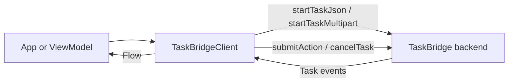
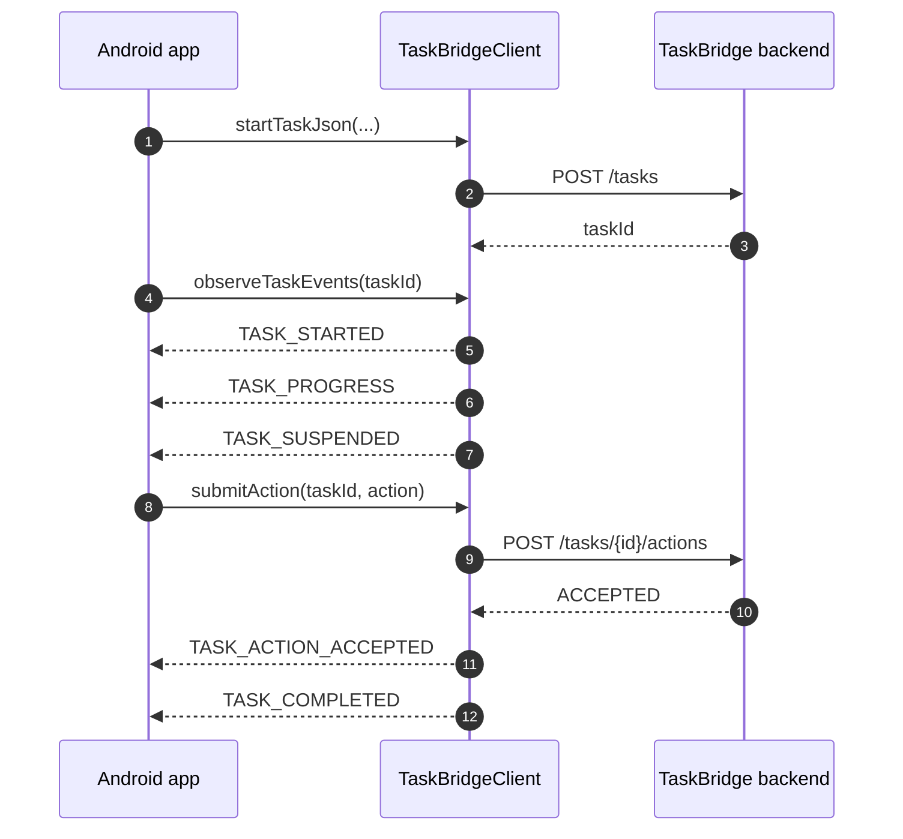

# Android SDK

The TaskBridge Android SDK is a `Flow`-first client for long-running backend tasks that may stream progress, suspend for user input, and recover across flaky mobile networks.

This section is the human-readable guide for the Android surface. Use it together with the generated [Android API Reference](../reference/android.md): the guide explains the concepts and boundaries, while the reference lists the exact public symbols.

If you want the condensed LLM-friendly index for the whole docs site, use [llms.txt](../llms.txt).

## What the SDK owns

TaskBridge Android is responsible for:

- starting tasks with JSON or multipart input;
- observing task events as a replay-safe `Flow<TaskEvent>`;
- retrying transient network failures for commands and streams;
- resuming a stream from the last durable checkpoint;
- deduplicating replayed events by `eventId`;
- handling human-in-the-loop task suspensions through `submitAction`.

TaskBridge Android is intentionally not responsible for:

- defining product-specific task payloads;
- rendering UI for progress, approval dialogs, or forms;
- storing your domain data in Room or another local database;
- inventing backend routes beyond the configured contract.

## Module layout

The Android SDK is split into two publishable artifacts:

- `taskbridge-core`
  Transport-agnostic API, models, checkpointing, retry/failure policies, and stream orchestration.
- `taskbridge-transport-okhttp`
  Default networking adapter built on OkHttp, Retrofit, WebSockets, and SSE.

This split matters in practice:

- choose only `taskbridge-core` if you want to build a custom transport;
- add `taskbridge-transport-okhttp` if you want the standard production transport.

## Installation

```kotlin
dependencies {
    implementation("io.github.nikkiw.taskbridge:taskbridge-core:VERSION")
    implementation("io.github.nikkiw.taskbridge:taskbridge-transport-okhttp:VERSION")
}
```

## Mental model

Think of one backend task as a durable event stream.



The client is command-based for writes and stream-based for reads:

- command methods:
  `startTaskJson`, `startTaskMultipart`, `submitAction`, `cancelTask`
- read method:
  `observeTaskEvents`

## End-to-end lifecycle



## Real client example

This shape matches the actual sample code in the Android source tree.

```kotlin
val client =
    TaskBridgeClient.create(
        TaskBridgeConfig(
            baseUrl = "https://api.example.com",
            transportFactory =
                OkHttpTaskBridgeTransportFactory<Unit>(
                    OkHttpTaskBridgeTransportConfig(
                        okHttpClient = OkHttpClient(),
                    ),
                ),
            authHeaderProvider = { _, _ -> "Bearer your-token" },
        ),
    )

val response =
    client.startTaskJson(
        TaskCreateJsonRequest(
            clientRequestId = "unique-req-123",
            taskType = "document.review",
            input =
                buildJsonObject {
                    put("documentId", "doc-123")
                },
        ),
    )

client.observeTaskEvents(response.taskId).collect { event ->
    when (event) {
        is TaskProgressEvent -> println("Progress: ${event.payload["progress"]}%")
        is TaskCompletedEvent -> println("Task finished successfully!")
        else -> Unit
    }
}
```

## What to read next

- [Client and Config](client-config.md)
  How to build a client, choose `Ctx`, inject auth, and override routes.
- [Events and Recovery](events-and-recovery.md)
  The event model, replay rules, deduplication, suspensions, and terminal states.
- [Transport and Extension Points](transport-and-extension-points.md)
  How WS, SSE, and polling work, and where to customize networking.
- [Storage and Policies](storage-and-policies.md)
  Checkpoint stores, namespaces, retry policy, and failure classification.

## Build and validation

Run from `android/`:

```bash
./gradlew test
./gradlew dokkaGenerateMultiModuleHtml
```

## Related docs

- [Android API Reference](../reference/android.md)
- [Protocol](../protocol/index.md)
- [Examples](../examples/index.md)
- [ADR overview](../adr/index.md)
