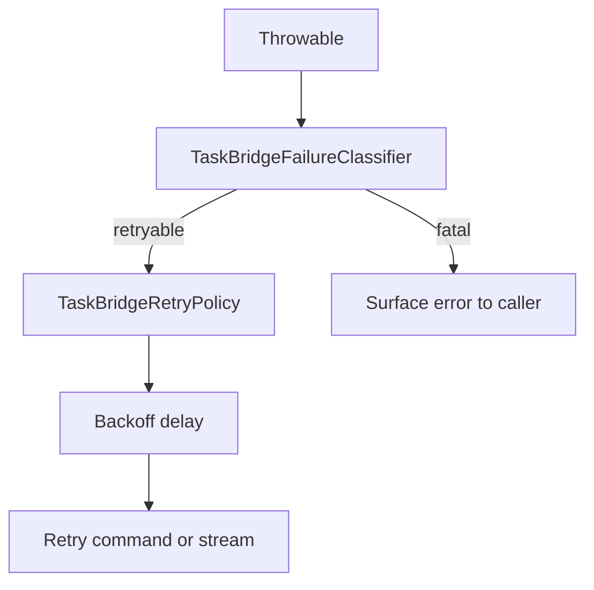

# Storage and Policies

This page covers the pieces that make the Android SDK resilient over time rather than only correct in the happy path: checkpoint persistence, retry backoff, and failure classification.

## Checkpoint store

`TaskBridgeCheckpointStore` is the durable boundary for stream resume state.

It has three responsibilities:

- `load(key)`
- `save(key, lastEventId)`
- `clear(key)`

The SDK writes checkpoints after emitted events and clears them on terminal events.

## Available store implementations

### `InMemoryTaskBridgeCheckpointStore`

Use it when:

- tasks are short-lived;
- process death recovery does not matter;
- you are testing or prototyping.

Do not use it when you need resume after app restart.

### `DataStoreTaskBridgeCheckpointStore`

Use it when:

- you want stream recovery across process death;
- your app already accepts AndroidX DataStore as part of the dependency graph;
- you need stable resume behavior between foreground and background work.

Real setup shape:

```kotlin
val checkpointStore =
    DataStoreTaskBridgeCheckpointStore(
        file = File(filesDir, "taskbridge-checkpoints.preferences_pb"),
        scope = CoroutineScope(SupervisorJob() + Dispatchers.IO),
    )
```

This store uses Jetpack DataStore preferences under the hood and URL-encodes keys before persistence.

## Checkpoint key design

Checkpoint keys are built from:

- optional namespace;
- normalized base URL;
- task ID.

This prevents collisions across environments like staging and production.

Practical implication:

- the same `taskId` from two different backends does not overwrite the same checkpoint;
- adding a namespace lets one app isolate multiple TaskBridge consumers cleanly.

## Namespace guidance

Use `checkpointNamespace` when:

- one app talks to multiple logical TaskBridge consumers;
- you want to isolate task classes or product areas;
- migrations need old and new checkpoint spaces to coexist temporarily.

Do not add namespaces casually if one client already owns the whole checkpoint file. Extra namespaces are useful when they express a real ownership boundary.

## Retry policy

`TaskBridgeRetryPolicy` answers one question: how long should the SDK wait before the next retry attempt?

The default implementation is `ExponentialBackoffTaskBridgeRetryPolicy`.

Current behavior:

- base delay starts at `500ms`;
- delay grows exponentially;
- exponential growth is capped;
- jitter is added to avoid synchronized retries.

This is the right default for most mobile apps because it avoids both hot-loop retries and overly slow recovery.

## Failure classifier

`TaskBridgeFailureClassifier` decides whether a failure is retryable.

Default behavior:

- retry `IOException`;
- retry HTTP `429`;
- retry HTTP `5xx`;
- do not retry serialization failures;
- do not treat `401` as generally retryable in the classifier.

The `401` case is special:

- auth refresh is given a narrow chance in the transport layer;
- repeated auth failure eventually becomes fatal and terminates observation.

## Policy interaction



## When to customize policies

Customize `TaskBridgeRetryPolicy` when:

- your app needs tighter or slower retry pacing;
- you are integrating with backend rate limits that require specific backoff behavior.

Customize `TaskBridgeFailureClassifier` when:

- your backend returns additional retryable statuses;
- a proxy or gateway layer wraps transient failures in app-specific exception types.

Do not customize either one just because you want extra logging. Use diagnostics hooks for that.

## Recommended production baseline

For most Android consumers:

- use `DataStoreTaskBridgeCheckpointStore`;
- keep `ExponentialBackoffTaskBridgeRetryPolicy`;
- keep `DefaultTaskBridgeFailureClassifier`;
- add a namespace only if you have multiple logical consumers.

That baseline is already aligned with the way TaskBridge stream recovery works internally.

## Related docs

- [Client and Config](client-config.md)
- [Events and Recovery](events-and-recovery.md)
- [Transport and Extension Points](transport-and-extension-points.md)
- [Android API Reference](../reference/android.md)
