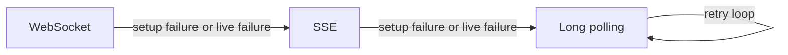
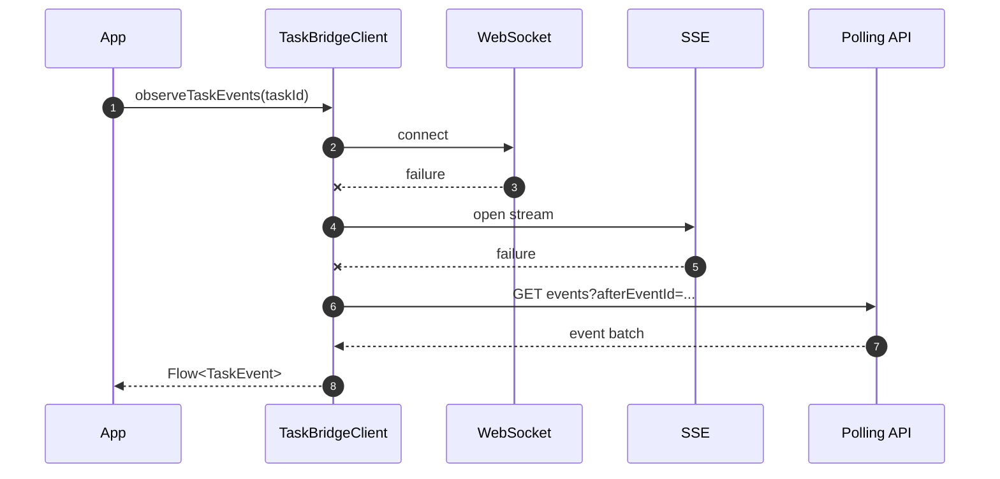

# Transport and Extension Points

The Android SDK separates the public task API from the networking engine. This is why `taskbridge-core` can stay transport-agnostic while `taskbridge-transport-okhttp` provides the default production implementation.

## Default transport stack

The standard adapter uses:

- Retrofit for command-style HTTP requests;
- OkHttp for shared HTTP execution;
- OkHttp WebSockets for the primary live stream;
- OkHttp SSE for the first fallback;
- long polling as the final compatibility layer.

This follows [ADR 0002](../adr/0002-android-networking.md) and [ADR 0003](../adr/0003-streaming-protocol.md).

## Fallback model



Two fallback strategies are available:

- `PROGRESSIVE_STICKY`
  Retry each better transport a bounded number of times, then fall back and stay on the next viable layer.
- `FAST_CYCLE`
  Move through transport options more aggressively.

The default is `PROGRESSIVE_STICKY`, which is the right production choice for most Android apps.

## What the transport boundary owns

Transport code is responsible for:

- turning HTTP, WebSocket, and SSE payloads into `TaskEvent`;
- reconnecting and replaying from the latest watermark;
- deduplicating recent replayed events;
- persisting checkpoints after successful emissions;
- surfacing diagnostics through listeners.

Transport code is not responsible for:

- interpreting product payload semantics;
- deciding how your UI renders progress or suspensions;
- storing your app-specific domain projections.

## Real factory example

```kotlin
val client =
    TaskBridgeClient.create(
        TaskBridgeConfig(
            baseUrl = "http://10.0.2.2:8000",
            transportFactory =
                OkHttpTaskBridgeTransportFactory(
                    OkHttpTaskBridgeTransportConfig(
                        okHttpClient = OkHttpClient(),
                    ),
                ),
        ),
    )
```

This is the main extension point for replacing or wrapping the networking layer.

## `TaskBridgeTransportFactory`

`TaskBridgeTransportFactory` creates a `TaskBridgeTransportBundle` with three parts:

- `TaskBridgeHttpApi`
- `WebSocketSessionFactory`
- `SseSessionFactory`

Use a custom factory when you need:

- a different HTTP engine;
- custom WebSocket or SSE implementation;
- deep transport instrumentation that should stay below the public client layer.

Do not build a custom factory just to add logging. For most apps, `TaskBridgeTransportEventListener` or an interceptor is sufficient.

## `TaskBridgeHttpApi`

This interface is the command boundary for:

- task creation;
- multipart uploads;
- event polling;
- cancellation;
- action submission.

It exists to keep the core library independent from Retrofit and OkHttp classes.

## Event listeners and diagnostics

`TaskBridgeTransportEventListener` lets you observe transport behavior without changing the public client API.

It exposes hooks such as:

- `onWsSetupFailed`
- `onFallbackToSse`
- `onFallbackToPolling`
- `onPollEvent`
- `onSseEvent`
- `onRawPayload`
- `onMalformedWirePayload`

Use it for:

- debug logging;
- test diagnostics;
- observability breadcrumbs;
- tracking fallback frequency.

Do not use it as your product event-processing API. It is a transport diagnostic surface, not a replacement for `observeTaskEvents`.

## Interceptors

The core module also provides `TaskBridgeInterceptor`, which can wrap a transport bundle:

```kotlin
val interceptedFactory =
    OkHttpTaskBridgeTransportFactory<Unit>(
        OkHttpTaskBridgeTransportConfig(
            okHttpClient = OkHttpClient(),
        ),
    ).withInterceptor { bundle ->
        bundle
    }
```

This is useful when you need to decorate the bundle as a whole, not just react to emitted diagnostics.

### Debug transport override example

An interceptor is also a good fit when you want to force a fallback path during manual QA or debug builds.

Typical use case:

- disable WebSocket to verify SSE behavior;
- disable both WebSocket and SSE to verify polling behavior;
- keep the rest of the app code unchanged while you test recovery and fallback UX.

Example shape:

```kotlin
enum class DebugTransportMode {
    AUTO,
    FORCE_SSE,
    FORCE_POLLING,
}

class DebugTransportOverrideInterceptor<Ctx>(
    private val mode: () -> DebugTransportMode,
) : TaskBridgeInterceptor<Ctx> {
    override fun intercept(bundle: TaskBridgeTransportBundle<Ctx>): TaskBridgeTransportBundle<Ctx> {
        val currentMode = mode()

        val newWsFactory = when (currentMode) {
            DebugTransportMode.AUTO -> bundle.webSocketFactory
            DebugTransportMode.FORCE_SSE,
            DebugTransportMode.FORCE_POLLING,
            -> failingWebSocketFactory(
                "WS disabled by debug transport mode",
            )
        }

        val newSseFactory = when (currentMode) {
            DebugTransportMode.AUTO,
            DebugTransportMode.FORCE_SSE,
            -> bundle.sseSessionFactory
            DebugTransportMode.FORCE_POLLING -> failingSseSessionFactory(
                "SSE disabled by debug transport mode",
            )
        }

        return bundle.copy(
            webSocketFactory = newWsFactory,
            sseSessionFactory = newSseFactory,
        )
    }
}
```

This pattern is valuable because it tests the real TaskBridge fallback logic rather than introducing product-specific test branches above the SDK layer.

Recommended boundary:

- keep this kind of interceptor in debug-only or internal QA wiring;
- do not ship forced fallback modes as part of the normal production path unless you have a clear operational reason.

## Command retry vs stream retry

TaskBridge treats command operations and stream observation differently.

Commands:

- use bounded retry attempts;
- rely on `TaskBridgeFailureClassifier`;
- wait according to `TaskBridgeRetryPolicy`.

Streams:

- try to keep the `Flow` alive on retryable failures;
- resume from the latest checkpoint;
- change transport when needed.

That distinction matters because a failed `startTaskJson` is a short operation, while a failed stream is part of a long-lived recovery loop.

## Interaction timeline



## Boundaries for custom networking

- Keep auth injection in `authHeaderProvider` unless the transport implementation truly must own it.
- Keep route shaping in `TaskBridgeRouteResolver`.
- Keep transport replacement below `TaskBridgeClient`, so the rest of the app still depends on the same public API.

## Related docs

- [Client and Config](client-config.md)
- [Events and Recovery](events-and-recovery.md)
- [Storage and Policies](storage-and-policies.md)
- [ADR 0002](../adr/0002-android-networking.md)
- [ADR 0003](../adr/0003-streaming-protocol.md)
