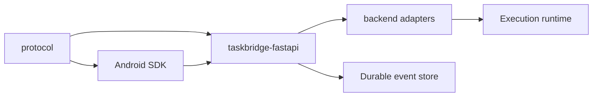

# Architecture

TaskBridge is a repository-level integration library with strict boundaries between protocol, transport, orchestration, and runtime-specific execution.

## System layers

- `protocol/`
  Wire contract, event envelope, replay cursor semantics, and compatibility fixtures.
- `android/`
  Client SDK, checkpoints, retry/fallback behavior, and `Flow<TaskEvent>` API.
- `backend/taskbridge-fastapi/`
  Reusable FastAPI services, route builders, readiness, security hooks, and stream runtime helpers.
- `backend/adapters/`
  Runtime-specific bridges such as Temporal, implemented against stable backend extension points.
- `examples/`
  Reference hosts and consumer setups.

## Architectural story

TaskBridge is built around one core idea: a task is a durable stream of ordered events.

That produces four stable boundaries:

- protocol defines what an event means on the wire;
- backend owns orchestration, auth hooks, replay, and transport endpoints;
- adapters bridge backend core to a concrete execution runtime;
- Android owns client recovery, checkpoints, and fallback behavior.

## Cross-layer invariants

- task streams are keyed by `taskId`
- replay and deduplication use monotonic `eventId`
- backend event history must be durable enough to support replay
- Android public API remains a stable `Flow<TaskEvent>`
- transport fallback must not change consumer semantics
- execution runtime specifics must stay behind adapter boundaries

## Durable vs ephemeral boundaries

Durable state:

- task registry records;
- event history in the event store;
- suspension and action-receipt state;
- runtime workflow state inside Temporal or another engine.

Ephemeral state:

- live WebSocket and SSE connections;
- polling wait loops;
- Android in-memory dedup windows;
- host request lifecycle objects.

## Layer map

## Deep-dive topics

- host ownership and service/route layering live in [Backend](../backend/index.md)
- client recovery and fallback behavior live in [Android](../android/index.md)
- adapter boundaries live in [Adapters](../adapters/index.md)
- executor split and runtime integration live in [Executor Integration](../executor-integration.md)
- security hooks and ownership model live in [Security Integration](../security-integration.md)
- observability and readiness hooks live in [Observability and Ops](../observability-ops.md)
- higher-level decision records are summarized in [ADR](../adr/index.md)
