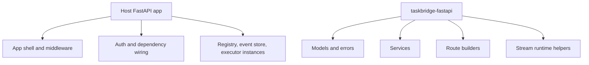

# Host Integration

`taskbridge-fastapi` is designed to be embedded into a host FastAPI application, not to replace it. The host owns the application shell and infrastructure wiring; TaskBridge owns the task-streaming contract and orchestration around it.

## What the host owns

The host application owns:

- `FastAPI()` construction;
- middleware and request lifecycle;
- authentication strategy;
- dependency override wiring;
- concrete `TaskRegistry`, `EventStore`, and `TaskExecutor` implementations;
- any runtime adapter instances such as Temporal clients.

The host is also the right place for product-specific preprocessing before a task is created.

## What TaskBridge owns

TaskBridge owns:

- typed models and stable error envelopes;
- service-layer orchestration;
- reusable HTTP, SSE, and WebSocket route builders;
- replay-safe task event delivery semantics;
- host-overridable observability and readiness abstractions.

The host should not re-implement stream loops manually if a TaskBridge helper already covers that case.

## Ownership boundary



## Real integration shape

```python
from fastapi import FastAPI

from taskbridge.routes_http import build_http_router, install_http_exception_handlers
from taskbridge.routes_ws import build_ws_router

app = FastAPI()
app.include_router(build_http_router())
app.include_router(build_ws_router())
install_http_exception_handlers(app)
```

This is the intended integration direction: use TaskBridge route builders and then wire host-specific dependencies underneath them.

## Dependency override model

The route builders rely on dependency hooks such as:

- `get_task_creation_service`
- `get_task_polling_service`
- `get_task_cancellation_service`
- `get_task_action_service`
- `get_websocket_subscription_service`
- `get_auth_context_resolver`
- `get_ownership_policy`
- `get_upload_policy`
- `get_metrics_sink`
- `get_transport_diagnostics_sink`
- `get_readiness_probe`

This keeps route code generic while letting the host inject real infrastructure.

## Good host patterns

- keep auth resolution in host wiring and convert it into `AuthContext`;
- keep storage implementations outside the TaskBridge package;
- keep runtime-specific clients and adapters in your host or adapter layer;
- keep domain-level task shaping outside the generic route and service code.

## Bad host patterns

- handwritten SSE generators that duplicate TaskBridge stream runtime helpers;
- direct vendor runtime logic inside `taskbridge-fastapi` core;
- embedding product authorization rules directly in generic route code.

## Related docs

- [Services and Routes](services-and-routes.md)
- [Security, Readiness, and Observability](security-readiness-observability.md)
- [State and Runtime Boundaries](state-and-runtime-boundaries.md)
- [Adapters](../adapters/index.md)
