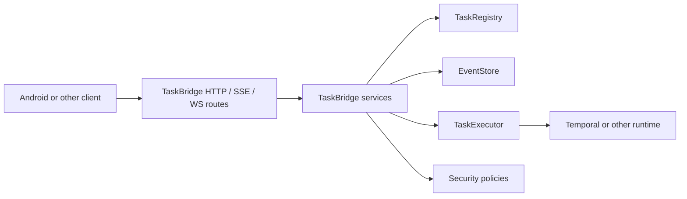
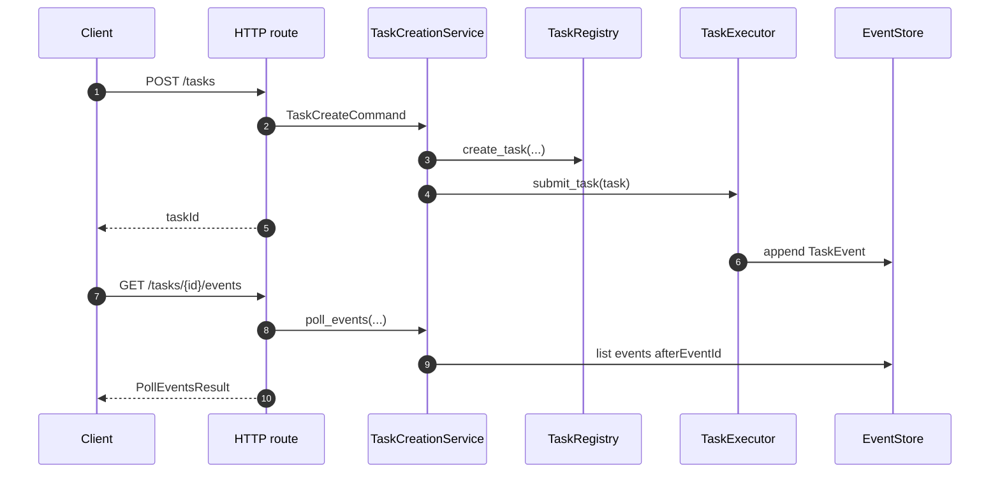

# Backend

`taskbridge-fastapi` is the reusable backend package for embedding TaskBridge into host FastAPI applications. It gives you the task-streaming infrastructure layer without taking over your app shell, auth system, or runtime-specific execution backend.

This section is the human-readable backend guide. Use it together with the generated [Python API Reference](../reference/backend.md): these pages explain the concepts and ownership boundaries, while the API reference lists exact Python symbols.

If you want the condensed LLM-friendly index for the whole docs site, use [llms.txt](../llms.txt).

## What the backend package owns

TaskBridge backend is responsible for:

- typed request, response, and event models;
- service orchestration around task creation, polling, cancellation, and actions;
- reusable HTTP, SSE, and WebSocket route builders;
- replay-safe event delivery over polling and live streams;
- readiness, metrics, and transport diagnostics hooks;
- stable extension points for host infrastructure and execution adapters.

TaskBridge backend is intentionally not responsible for:

- creating your `FastAPI()` application shell;
- choosing your auth provider or middleware stack;
- persisting domain-specific business state outside the task transport layer;
- coupling the core backend package to Temporal or any other workflow vendor.

## Mental model

Think of `taskbridge-fastapi` as the transport and orchestration layer between three host-owned boundaries:

- who is allowed to act;
- where task and event state lives;
- how work is actually executed.



## Integration model

The most important backend extension points are:

- `TaskRegistry`
- `EventStore`
- `TaskExecutor`
- `AuthContextResolver`
- `OwnershipPolicy`
- `UploadPolicy`
- `MetricsSink`
- `ReadinessProbe`

This split matters:

- the host owns durable infra and auth;
- TaskBridge owns task transport semantics and service coordination;
- adapters connect TaskBridge to a concrete execution runtime.

## End-to-end backend lifecycle



## Real host wiring example

This is the actual style of integration TaskBridge expects: your app composes routers and dependency overrides rather than re-implementing transport loops.

```python
from fastapi import FastAPI

from taskbridge.routes_http import build_http_router, install_http_exception_handlers
from taskbridge.routes_ws import build_ws_router

app = FastAPI()
app.include_router(build_http_router())
app.include_router(build_ws_router())
install_http_exception_handlers(app)
```

## What to read next

- [Host Integration](host-integration.md)
  What the host app owns, what TaskBridge owns, and where adapters fit.
- [Services and Routes](services-and-routes.md)
  How commands and stream delivery move through services and reusable route builders.
- [Security, Readiness, and Observability](security-readiness-observability.md)
  Auth resolution, ownership rules, upload policy, metrics, diagnostics, and readiness probes.
- [State and Runtime Boundaries](state-and-runtime-boundaries.md)
  Registry, event store, suspension/action state, retention, stream runtime settings, and replay boundaries.
- [Adapters](../adapters/index.md)
  Runtime-specific execution layers such as Temporal.

## Related docs

- [Python API Reference](../reference/backend.md)
- [OpenAPI Reference](../reference/backend-api/index.html)
- [Protocol](../protocol/index.md)
- [Architecture](../architecture/index.md)
