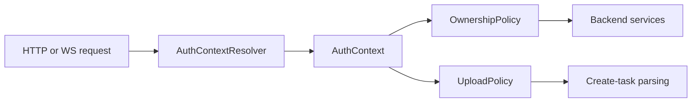
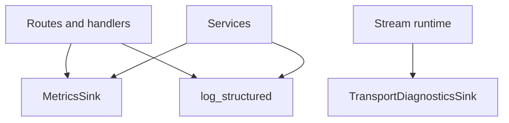

# Security, Readiness, and Observability

These abstractions are where host-specific policy enters the backend package without contaminating the generic task transport layer.

## Security extension points

The main security interfaces are:

- `AuthContextResolver`
- `OwnershipPolicy`
- `UploadPolicy`

They exist because TaskBridge should not choose your auth provider or product access rules.

## `AuthContextResolver`

`AuthContextResolver` converts an incoming request object into `AuthContext`.

Important boundary:

- the host owns request authentication;
- TaskBridge consumes only the normalized `AuthContext`.

That keeps route and service logic independent from JWT libraries, session middleware, or internal service auth details.

## `OwnershipPolicy`

`OwnershipPolicy` controls:

- whether a user can create a task;
- whether a user can access an existing task.

This is the main authorization layer for create/read/cancel/subscribe behavior.

Recommended mental model:

- the host authenticates;
- TaskBridge enforces ownership-based access on normalized task records.

## `UploadPolicy`

`UploadPolicy` decides whether a set of attachments is allowed for the authenticated actor.

Use it for:

- file quota rules;
- content restrictions;
- actor-specific upload permissions.

Do not overload it with generic task authorization. That belongs in `OwnershipPolicy`.

## Security flow



## Readiness model

Readiness is host-overridable and composable.

Key abstractions:

- `ReadinessProbe`
- `AlwaysReadyProbe`
- `CompositeReadinessProbe`
- `RedisReadinessProbe`
- `ExecutorReadinessProbe`

Use `CompositeReadinessProbe` when readiness should reflect multiple real dependencies instead of a fake “app started” signal.

Real composition shape:

```python
probe = CompositeReadinessProbe(
    {
        "redis": RedisReadinessProbe(redis_client),
        "executor": ExecutorReadinessProbe(executor_adapter),
    }
)
```

This is the backend-side equivalent of saying “the service is ready only if the stream store and execution layer are actually reachable.”

## Metrics and diagnostics

The backend package provides:

- `MetricsSink`
- `NoOpMetricsSink`
- `TransportDiagnosticsSink`
- `NoOpTransportDiagnosticsSink`
- `log_structured(...)`

Use `MetricsSink` for product-grade counters and gauges.

Use `TransportDiagnosticsSink` for low-level stream delivery diagnostics such as:

- replay starts;
- heartbeats;
- delivery confirmations;
- disconnect tracking.

## Observability boundary



This split matters because transport diagnostics are lower-level than business metrics. A host may choose to collect both, but they answer different questions.

## Recommended host usage

- map app auth into `AuthContext` once;
- implement a real ownership policy;
- implement an upload policy if multipart is enabled;
- compose readiness from real dependencies;
- wire a real metrics sink in production;
- keep structured logs with `taskId`, `eventId`, and `clientRequestId`.

## Related docs

- [Host Integration](host-integration.md)
- [Services and Routes](services-and-routes.md)
- [State and Runtime Boundaries](state-and-runtime-boundaries.md)
- [Observability and Ops](../observability-ops.md)
- [Security Integration](../security-integration.md)
