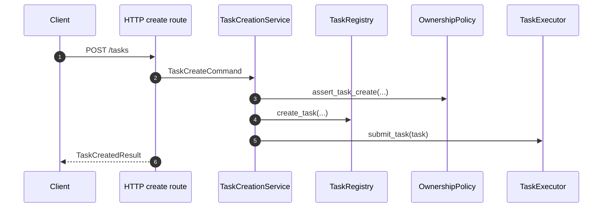
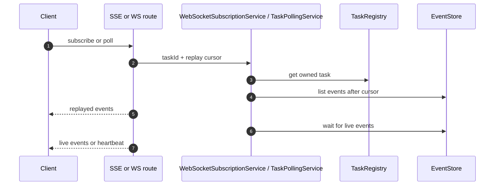

# Services and Routes

The backend package splits transport entrypoints from business orchestration.

- routes own HTTP, SSE, and WebSocket request handling;
- services own validation, task lookup, ownership checks, idempotency, and coordination with storage and executors.

This is the main reason the backend stays reusable across host apps.

## Route builders

The reusable route builders are:

- `build_http_router`
- `build_ws_router`
- `install_http_exception_handlers`

The HTTP builder covers:

- create task;
- poll events;
- SSE event stream;
- cancel task;
- submit action;
- health and readiness endpoints.

The WebSocket builder covers:

- subscribe request parsing;
- replay delivery;
- live wait loop;
- heartbeat frame emission;
- terminal close handling.

## Route settings

Backend route behavior is configurable through typed settings objects:

- `HttpRouteSettings`
- `WebSocketRouteSettings`
- `StreamRuntimeSettings`

Use these when the host needs:

- different path layouts;
- upload limits;
- SSE or WebSocket runtime tuning.

## Real route example

This shape comes directly from the backend route layer.

```python
@router.post(actual_settings.create_task_path, response_model=TaskCreatedResult)
async def create_task(
    request: Request,
    response: Response,
    auth_context: Annotated[AuthContext, Depends(resolve_http_auth_context)],
    service=TASK_CREATION_SERVICE,
    upload_policy: UploadPolicy = UPLOAD_POLICY,
) -> TaskCreatedResult:
    command = await _parse_create_task_command(
        request=request,
        auth_context=auth_context,
        settings=actual_settings,
        upload_policy=upload_policy,
    )
    result = await service.create_task(command)
    response.status_code = 200 if result.deduplicated else 201
    return result
```

The route parses transport-specific input and hands the real decision-making to a service.

## Service layer

The main backend services are:

- `TaskCreationService`
- `TaskPollingService`
- `TaskCancellationService`
- `TaskActionService`
- `WebSocketSubscriptionService`
- `TaskResumeService`
- `TaskResumeReconciliationService`
- `TaskRetentionService`

These services coordinate core backend interfaces:

- `TaskRegistry`
- `EventStore`
- `TaskExecutor`
- `OwnershipPolicy`
- suspension and action receipt stores.

## Command and stream split

TaskBridge treats command-style operations and stream delivery as different backend concerns.

Commands:

- create or mutate task state;
- validate ownership and idempotency;
- call registry or executor boundaries.

Stream delivery:

- replays from `afterEventId` or `lastEventId`;
- emits events over polling, SSE, or WebSocket;
- preserves transport-level replay semantics without changing service semantics.

## Creation flow



## Streaming flow



## Action and resume flow

`TaskActionService` is the main service for human-in-the-loop resume flow.

It:

- validates ownership and allowed actions;
- deduplicates by `client_action_id`;
- checks suspension status;
- records accepted action receipts;
- appends action-accepted task events;
- hands off to resume orchestration.

This is why action submission belongs in backend core and not inside a runtime adapter.

## What not to re-implement

- SSE response formatting;
- `Last-Event-ID` replay loops;
- WebSocket subscribe frame handling;
- heartbeat framing and idle transport loops.

Those are already owned by the backend package.

## Related docs

- [Host Integration](host-integration.md)
- [Security, Readiness, and Observability](security-readiness-observability.md)
- [State and Runtime Boundaries](state-and-runtime-boundaries.md)
- [Protocol](../protocol/index.md)
