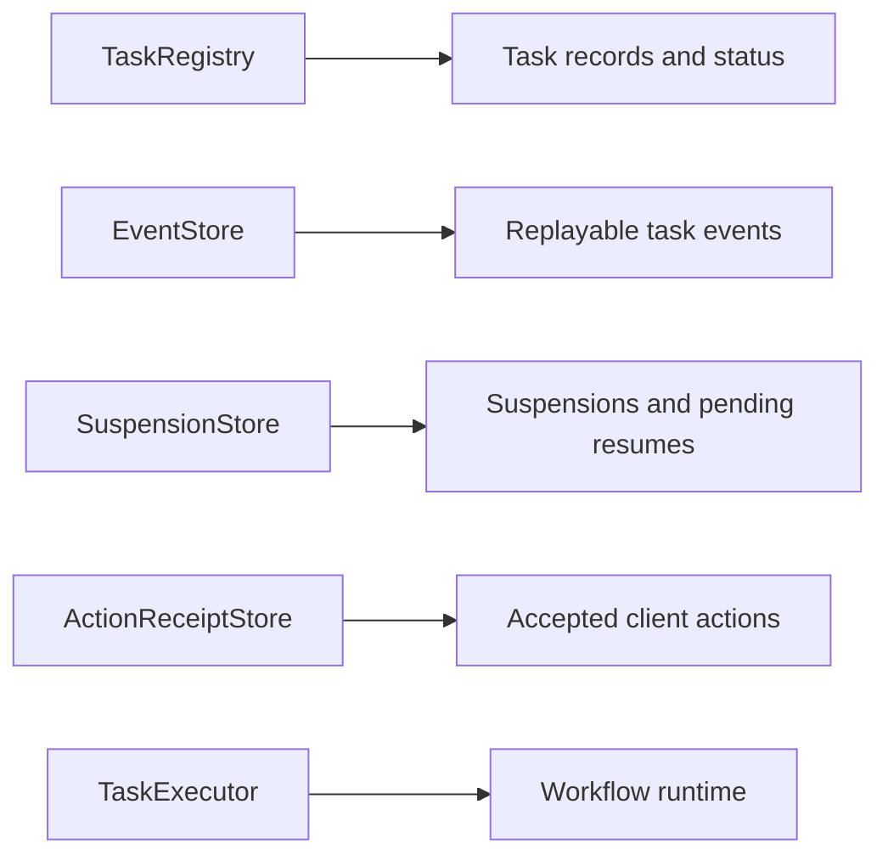
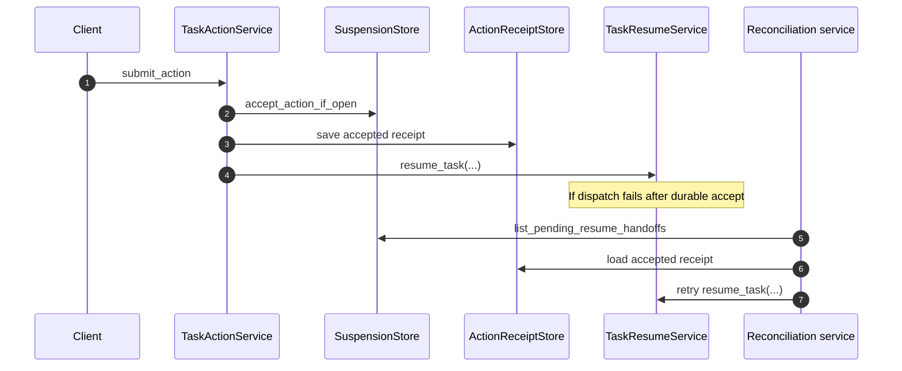

# State and Runtime Boundaries

This page explains where backend state lives, which parts are durable, and how TaskBridge separates transport runtime concerns from task execution concerns.

## Core state interfaces

The main durable boundaries in backend core are:

- `TaskRegistry`
- `EventStore`
- `SuspensionStore`
- `ActionReceiptStore`

These are the stores TaskBridge depends on to make idempotency, replay, and action resumption reliable.

## What each store owns

`TaskRegistry` owns:

- task records;
- task status transitions;
- idempotency lookup by `clientRequestId`;
- cancellation requested state.

`EventStore` owns:

- ordered task event history;
- replay after an event cursor;
- durable event IDs used by client resume flows.

`SuspensionStore` and `ActionReceiptStore` own:

- durable record of task suspensions;
- accepted client actions;
- pending resume handoff state;
- expiration and reconciliation inputs.

## State boundary map

## Replay and stream runtime

Replay semantics are stable at the service and protocol level, but transport runtime settings are configurable.

Relevant runtime settings objects:

- `SseStreamSettings`
- `WebSocketStreamSettings`
- `StreamRuntimeSettings`

These control stream behavior such as:

- heartbeat emission;
- wait timeout tuning;
- runtime-specific close behavior.

Use them when hosts need operational tuning. Do not use them to redefine the protocol itself.

## Durable vs ephemeral boundaries

TaskBridge backend durable state:

- task records;
- replayable event history;
- accepted action receipts;
- pending resume handoffs.

TaskBridge backend ephemeral runtime state:

- live SSE generator loop;
- WebSocket connection state;
- heartbeat timing;
- in-flight request handling.

Runtime adapter durable state:

- workflow state inside Temporal or another execution engine.

This split prevents the transport layer from becoming the workflow engine.

## Resume and reconciliation

`TaskResumeService` is the host hook for continuing a suspended task after a durable action accept.

`TaskResumeReconciliationService` exists because resume handoff may fail after the action was already durably accepted.

That means:

- action acceptance must be durable first;
- resume dispatch can be retried later;
- reconciliation is part of correctness, not just cleanup.

## Resume flow

## Retention

`TaskRetentionService` is the cleanup boundary for expired receipts and suspensions.

This is operationally important because action and suspension correctness depends on durable state, but that state must still be pruned over time.

## What not to conflate

- `EventStore` is not your workflow engine state store.
- `TaskRegistry` is not a replacement for domain-specific job metadata.
- WebSocket or SSE runtime settings do not change backend protocol semantics.
- action receipt durability and resume dispatch are related but not identical concerns.

## Related docs

- [Host Integration](host-integration.md)
- [Services and Routes](services-and-routes.md)
- [Security, Readiness, and Observability](security-readiness-observability.md)
- [Adapters](../adapters/index.md)
