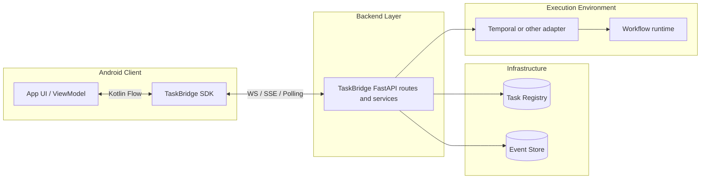
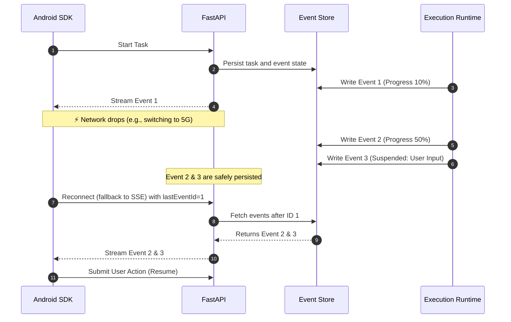

# TaskBridge

**Reliable AI Task Streaming library for Android and FastAPI.**

TaskBridge is a protocol-driven infrastructure layer for long-running, interactive tasks that must survive flaky mobile networks and backend/runtime boundaries. It separates three concerns cleanly:

- client SDK behavior on Android;
- reusable backend transport and orchestration;
- runtime-specific execution adapters such as Temporal.

## The Problem

Standard WebSockets are brittle on mobile devices. When a task runs for tens of seconds or pauses for user input, a network switch between Wi-Fi and 5G can break the stream, duplicate requests, or lose user-visible progress. On the backend side, transport handling, auth, replay state, and workflow execution often get tangled together into one service that is hard to embed or evolve.

## The Solution

TaskBridge treats every task as a durable, replayable event stream. The backend and client agree on stable replay semantics based on monotonic `eventId`, while execution remains behind adapter boundaries. Transport delivery is intentionally **at-least-once** at the wire level, but consumers get replay-safe behavior through checkpoints, deduplication, and durable event history.

### Core Capabilities

- **Human-in-the-loop suspensions:** `TASK_SUSPENDED` and action submission are first-class parts of the protocol.
- **Durable replay and recovery:** Android resumes from checkpoints; backend replays from durable event history.
- **Graceful transport fallback:** Android degrades from **WebSocket -> SSE -> Long Polling** without changing the public API.
- **Host-owned backend shell:** FastAPI hosts keep app construction, auth, and infra wiring; TaskBridge provides the reusable task transport layer.
- **Runtime isolation through adapters:** Temporal or future runtimes implement stable backend extension points instead of leaking into core.
- **Strict idempotency:** Task creation and action submission are designed around stable client-generated IDs.

---

## High-Level Architecture

TaskBridge strictly separates transport, orchestration, and execution runtime.



### The Recovery Loop

When a network disruption occurs, TaskBridge resumes from durable state rather than from transient connection memory.



---

## Developer Experience

TaskBridge is designed to feel native to both Android and Python ecosystems, but each layer has a different integration style.

**Android Integration (Kotlin Coroutines)**

The Android SDK exposes a `Flow<TaskEvent>` API and owns client-side recovery, checkpoints, and fallback behavior.

```kotlin
viewModelScope.launch {
    client.observeTaskEvents(taskId).collect { event ->
        render(event)
    }
}
```

**Backend (FastAPI)**

The backend package exposes reusable route builders and services. The host app wires infra and auth underneath them.

```python
app = FastAPI()
app.include_router(build_http_router())
app.include_router(build_ws_router())
```

---

## Project Structure

Publishable packages:

- `backend/taskbridge-fastapi`
- `android/taskbridge-core`
- `android/taskbridge-transport-okhttp`
- `backend/adapters/*` (for example Temporal integrations)

Repository support layers:

- `protocol/` for shared API contracts and fixtures
- `docs/` for architecture decisions and human-written documentation
- `examples/` for runnable consumer setups

## Next Steps

- [Getting Started](getting-started.md) for local setup and doc commands
- [Android](android/index.md) for client concepts and recovery model
- [Backend](backend/index.md) for host integration and route/service boundaries
- [Adapters](adapters/index.md) for runtime-specific execution layers
- [Architecture](architecture/index.md) for repository-wide boundaries
